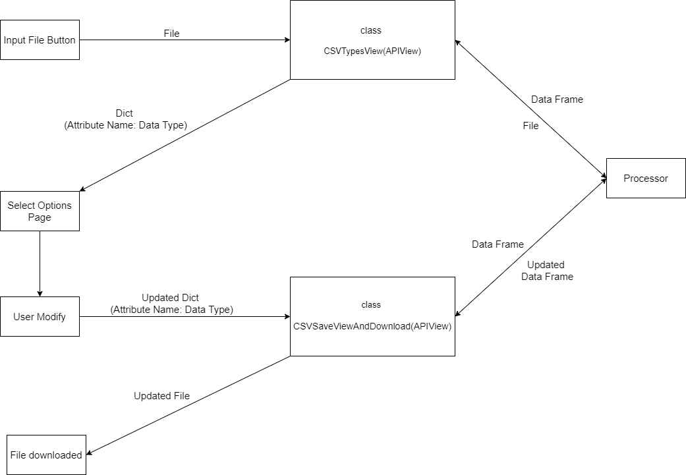
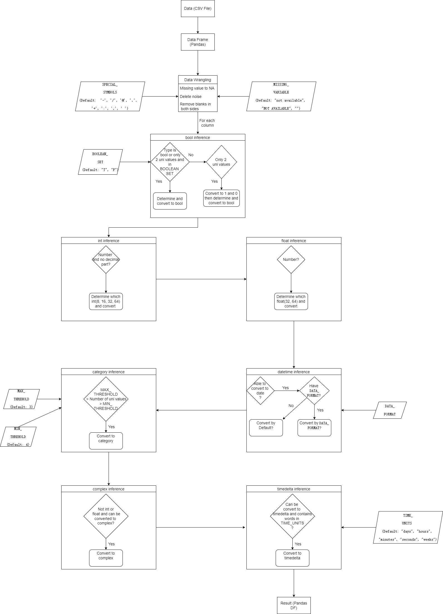

# Development Methodologies
  The backend used Django backend framework to connect the frontend and the processor of data type inference.
  
## Django Framework

### Initialization
1. Using django-admin startproject similar codes to initialize the project and install dependencies, libraries and so on.(Django base start project)
2. Create relative [settings](myproject/settings.py) to set initializing variables
3. Set relative universal urls in myproject
4. Put processor in csvhandler for processing data

### Work Flow

### Urls and Views
Create sub urls and views to:
1. Receive data from the frontend
2. Process data using processor
3. Return results to the frontend

Specific urls and views classes
1. upload/ and class CSVUploadView(APIView): Django APIView to handle the upload of a CSV file, process its data types, 
and allow the user to download the processed CSV file directly (Not used but remains operational for file processing and download.).
2. types/ and class CSVTypesView(APIView): Django APIView to process an uploaded CSV file, infer and store data types, 
and return a dict of column names to user-friendly data types.
3. save-types/ and class CSVSaveViewAndDownload(APIView): Django APIView to process updated data type dict, 
coerce data types in a DataFrame accordingly, and provide the updated data as a downloadable CSV.

Helper Functions
Some helper functions are used in: [process_functions](myproject/csvhandler/process_functions.py)

### How It Works?
1. When there is a csv file coming from the frontend, class CSVTypesView(APIView) receives it and uses processor to process
data and then generate a dict which includes the relationships between attributes and read-friendly inferred data type(Example： {'Name':'Text'})
2. When user modified the data type that they think is correct in the frontend and send this information to backend, the class CSVSaveViewAndDownload(APIView)
will detect the differences between the first dict and the dict after modifying, then it will force to convert it to designated data type and
return a new csv file to the front.

## Processor

The [processor](myproject/csvhandler/processor) can be viewed an independent python project, it processes the csv file input, and it performs a simple data wrangling,
then it infers data types in the following order: bool, int(64,32,16,8), float(64,32), datetime, category, complex and timedelta.
The specific steps and methodologies are as follows.

### Data Flow of Processor

### Global Variables
There are some global variables in [global_variables](myproject/csvhandler/processor/global_variables.py) and also some explanations.
You can modify it to make the results more desirable.

### Data Wrangling
1. First, it will convert [missing values](myproject/csvhandler/processor/global_variables.py) to NA.
2. Some noises will be deleted, [some specific symbols](myproject/csvhandler/processor/global_variables.py) will be kept.
3. The blanks on the left and right sides of the values in the table will be removed.

### Infer Column Data Type
#### Reasons why in this order:

The pandas library is often used for inference of data types, so there will be mutual influence between them, the specific reasons are:
1. The judgment of bool does not affect the judgment of other factors, so it is placed first.
2. Float inference will influence int, so it's after int inference
3. Datetime inference will influence both int and float, so it's after float
4. Complex inference will influence int and float, I put it after the datetime
5. Timedelta inference will influence int and float, I put it after the complex

#### Basic Algorithm or Methodologies
The specific achievements are in [infer_functions](myproject/csvhandler/processor/infer_functions.py)

bool: Determine if a column is a Boolean or has only two non-null values and in global [BOOLEAN_SET](myproject/csvhandler/processor/global_variables.py)

int: determine whether it's number first using pandas, then check if the decimal part is included, and judge what range it is in(64,32,16,8). NaN will be converted to "<NA>".

float: determine whether it's number first using pandas, then judge what range it is in(64,32). Keep a maximum of six decimal places in the end.

datetime: Checks if all value in the column can be successfully converted to date format, and converts the column. Also, it will try to convert by the [DATA_FORMAT](myproject/csvhandler/processor/global_variables.py) asked, convert by default if there is not.

category: Determine whether the number of unique values is below the [MAX_THRESHOLD](myproject/csvhandler/processor/global_variables.py)(4 by default) and bigger than the [MIN_THRESHOLD](myproject/csvhandler/processor/global_variables.py)(3 by default)

complex: Converts a column to complex type if all non-null values are parsable as complex numbers and not of type int or float.

timedelta: Converts a column to timedelta type if any value in the column can be successfully parsed as timedelta and includes [TIME_UNITS](myproject/csvhandler/processor/global_variables.py)(time words).
